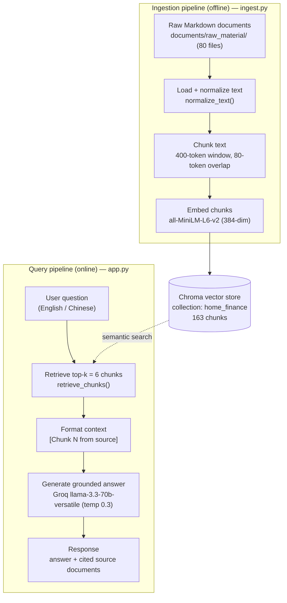

# Project 1 Planning: The Unofficial Guide

> Write this document before you write any pipeline code.
> Your spec and architecture diagram are what you'll use to direct AI tools (Claude, Copilot, etc.) to generate your implementation — the more specific they are, the more useful the generated code will be.
> Update the Retrieval Approach and Chunking Strategy sections if you change your approach during implementation.
> Update this file before starting any stretch features.

---

## Domain

This project covers home finance investment knowledge for families, including household investment strategy, tax-aware account selection, insurance planning, debt management, estate and gifting strategy, and retirement withdrawal planning. This knowledge is valuable because it helps households make better investment and savings decisions over the long term, and it is hard to find through official channels because investment guidance is often scattered across tax rules, insurance sales materials, retirement plan summaries, and general financial advice rather than being integrated into a family-focused home finance investment context.

---

## Documents

<!-- List your specific sources: URLs, subreddit names, forum threads, or file descriptions.
     Aim for at least 10 sources that together cover different subtopics or perspectives within your domain. -->

| # | Source | Description | URL or location |
|---|--------|-------------|-----------------|
| 1 | 现金流预算 | Practical guidance for household budgeting and expense planning. | `./documents/raw_material/家庭财务基础/现金流预算.md` |
| 2 | 净资产追踪 | Methods for tracking assets, liabilities, and long-term net worth growth. | `./documents/raw_material/家庭财务基础/净资产追踪.md` |
| 3 | 紧急基金 | Frameworks for sizing and maintaining a household emergency reserve. | `./documents/raw_material/家庭财务基础/紧急基金.md` |
| 4 | 保险规划总纲 | Overview of insurance categories and how they protect family financial goals. | `./documents/raw_material/家庭财务基础/保险规划总纲.md` |
| 5 | 债务管理 | Strategies for prioritizing debt repayment and reducing borrowing costs. | `./documents/raw_material/补充-家庭财务/债务管理.md` |
| 6 | 教育规划与风险管理 | Planning for education costs and balancing savings with insurance risk controls. | `./documents/raw_material/补充-家庭财务/教育规划与风险管理.md` |
| 7 | 应税账户基础 | Foundations of taxable investment accounts and when to use them. | `./documents/raw_material/补充-账户提取赠与/应税账户基础.md` |
| 8 | 遗产赠与税-提取策略 | Estate, gifting, and account withdrawal strategies for household transfer planning. | `./documents/raw_material/补充-账户提取赠与/遗产赠与税-提取策略.md` |
| 9 | 4%规则与安全提取率 | Retirement withdrawal rules for sustainable household spending after retirement. | `./documents/raw_material/退休规划/4%规则与安全提取率.md` |
| 10 | Backdoor-Roth-IRA | Tax-aware retirement account planning and Roth conversion strategy. | `./documents/raw_material/退休账户/Backdoor-Roth-IRA.md` |

---

## Chunking Strategy

<!-- How will you split documents into chunks?
     State your chunk size (in tokens or characters), overlap size, and explain why those
     numbers fit the structure of your documents.
     A review-heavy corpus warrants different chunking than a long FAQ. -->

**Chunk size:** 400 tokens

**Overlap:** 80 tokens

**Reasoning:**
The source documents are short-to-medium sized household finance notes and strategy summaries, so 400-token chunks keep each chunk focused on a single concept while leaving enough context for retrieval. An 80-token overlap preserves sentence and section continuity across chunk boundaries, helping prevent key financial recommendations or definitions from being split apart.

---

## Retrieval Approach

<!-- Which embedding model are you using (e.g., all-MiniLM-L6-v2 via sentence-transformers)?
     How many chunks will you retrieve per query (top-k)?
     If you were deploying this for real users and cost wasn't a constraint, what tradeoffs
     would you weigh in choosing a different embedding model — context length, multilingual
     support, accuracy on domain-specific text, latency? -->

**Embedding model:** all-MiniLM-L6-v2

**Top-k:** 6

**Production tradeoff reflection:**
For this homework project, `all-MiniLM-L6-v2` is a strong choice because it is compact, fast, and multilingual enough to handle the Chinese/English household finance source material. Retrieving the top 6 chunks balances precision with coverage, giving enough candidate context for generation without pulling too much irrelevant material. In production, I would weigh a higher-quality embedding model (e.g. OpenAI text-embedding-3-large or a domain-adapted financial embedding) if the cost and latency budget permitted it, especially to improve retrieval accuracy on tax and estate planning terminology. If latency were more important than marginal accuracy, I would keep a smaller model and tune top-k by observing retrieval relevance on held-out query samples.

---

## Evaluation Plan

<!-- List your 5 test questions with their expected correct answers.
     Questions should be specific enough that you can judge whether the system's response
     is right or wrong. "What are good dining halls?" is too vague.
     "What do students say about wait times at [dining hall name] during lunch?" is testable. -->

| # | Question | Expected answer |
|---|----------|-----------------|
| 1 | What emergency fund size does the household finance material recommend? | A reserve of about 3–6 months of living expenses. |
| 2 | Which account types are described as tax-efficient for retirement savings and what is a Backdoor Roth IRA? | Use tax-advantaged retirement accounts, Roth for tax-free growth, and a Backdoor Roth IRA is a strategy to contribute to Roth via nondeductible traditional IRA conversions when direct Roth contributions are limited. |
| 3 | How should families prioritize debt repayment and insurance planning? | Prioritize high-interest debt first and maintain adequate insurance coverage like term life, health, and property/casualty protection as part of household financial defense. |
| 4 | What asset location guidance is given for taxable, tax-deferred, and tax-free accounts? | Hold tax-inefficient assets like bonds in tax-deferred accounts, tax-efficient equities in taxable or Roth accounts, and use Roth for assets expected to grow most. |
| 5 | What is the 4% rule and what main caution is noted for retirement withdrawals? | Withdraw about 4% of the portfolio in the first year and adjust thereafter, while watching sequence-of-returns risk and longevity/inflation sensitivity. |

---

## Anticipated Challenges

<!-- What could go wrong? Name at least two specific risks with reasoning.
     Consider: noisy or inconsistent documents, missing source attribution, off-topic
     retrieval, chunks that split key information across boundaries. -->

1. Source documents may contain mixed Chinese and English financial terminology, which can cause retrieval noise if embeddings do not capture multilingual semantics consistently. This may lead to incorrect or partial answers when the user asks about tax or retirement concepts.

2. Chunk boundaries could split key definitions or recommendations across adjacent segments, reducing retrieval precision and causing the generator to miss the full context of a household finance rule. Overlap helps, but the pipeline still needs careful tuning to avoid fragmented reasoning.

---

## Architecture

---

## AI Tool Plan
     I'll give Claude my Chunking Strategy section and ask it to implement chunk_text()
     with my specified chunk size and overlap

<!-- For each part of the pipeline below, describe:
     - Which AI tool you plan to use (Claude, Copilot, ChatGPT, etc.)
     - What you'll give it as input (which sections of this planning.md, which requirements)
     - What you expect it to produce
     - How you'll verify the output matches your spec

     "I'll use AI to help me code" is not a plan.
     "I'll give Claude my Chunking Strategy section and ask it to implement chunk_text()
     with my specified chunk size and overlap" is a plan. -->

**Milestone 3 — Ingestion and chunking:**
- *Tool:* Claude (Claude Code).
- *Input I'll give it:* The Documents and Chunking Strategy sections of this file — specifically the source directory `documents/raw_material/`, the 400-token chunk size, and the 80-token overlap. I'll ask it to implement `ingest.py` with a markdown loader, a whitespace `normalize_text()` step, and a `chunk_text()` sliding-token-window function, writing each chunk with `source_path`/`chunk_index` metadata.
- *Expected output:* `ingest.py` (plus a standalone `chunk_text_strategy.py`) that loads all `.md` files, chunks them to 400/80, and prints the per-document and total chunk counts.
- *How I'll verify:* Run `python ingest.py` and confirm it loads 80 documents, that chunk counts look right for the document lengths, and spot-check that a known rule (e.g. "3–6 months", "4%") is not split across a chunk boundary.

**Milestone 4 — Embedding and retrieval:**
- *Tool:* Claude (Claude Code).
- *Input I'll give it:* The Retrieval Approach section — embedding model `all-MiniLM-L6-v2`, top-k = 6, and the requirement that results carry source attribution. I'll ask it to embed chunks into a persistent Chroma collection and implement `retrieve_chunks()` / `retrieve_and_format()`.
- *Expected output:* Chroma ingestion via `SentenceTransformerEmbeddingFunction`, plus `retrieval.py` returning the top-6 chunks with `id`, `source`, `chunk_index`, `text`, and `distance`.
- *How I'll verify:* Run the 5 evaluation questions through retrieval and confirm the top chunk for each comes from the expected document. (This is exactly how I caught two bugs — a collection-name mismatch and a metadata-key mismatch that made every `source` return `unknown` — which I then directed Claude to fix so attribution returns real document names.)

**Milestone 5 — Generation and interface:**
- *Tool:* Claude (Claude Code).
- *Input I'll give it:* The Domain section (for tone) and the grounding requirement — answer only from retrieved context, refuse when context is insufficient, and cite source documents. I'll ask it to implement `generation.py` (Groq `llama-3.3-70b-versatile`, temp 0.3) and an `app.py` Gradio interface wiring retrieval → generation.
- *Expected output:* A `SYSTEM_PROMPT` enforcing grounding, `build_grounded_prompt()`, `generate_answer()` returning answer + sources + grounding flag, and source attribution surfaced both inline (cited by document name) and programmatically (an appended `Sources:` line).
- *How I'll verify:* Run `python generation.py --evaluate` on the 5 test questions and check each answer is grounded, cites the right document(s), and that an out-of-scope question triggers the refusal response rather than a hallucinated answer.
